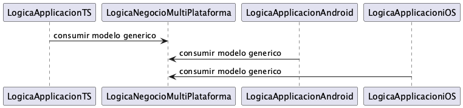
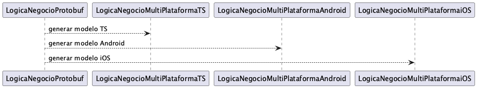

# Proyecto de Modelos Genéricos usando Protocol Buffers para Gestión Coordinada Diferentes Tech Stack

Este proyecto utiliza Protocol Buffers (protobuf) para definir modelos genéricos y poder generar el código correspondiente en varios lenguajes: Java, Kotlin, JavaScript y TypeScript.

# Propuesta

## Caso Uso: Crear logica negocio Multiplataforma

Compartimos definicion multiplataforma y reusamos en los difernetes stacks tecnológicos:



## Caso Uso: Crear logica negocio Protobuf

No es posible compartir la definicion para reuso, nos alineamos a nivel de contrato `*.proto` 
y generamos los contratos para cada lenguaje



## Caso Uso: Crear logica negocio Independiente

No es posible compartir la definicion para reuso, se toma la decisión de cada tecnología 
crecer de manera independiente.

[reuso-logica-negocio-no-ideal.puml](src/main/plantuml/reuso-logica-negocio-no-ideal.puml)

# Configuración del Proyecto

## Descargar proyecto
```shell
$ git clone https://github.com/davisusanibar/protobuf-kotlin-js-swift.git
```

## Dependencias/Software:

### Dependencia necesitada por los diferentes lenaguajes

```shell
brew install protobuf
```

### Dependencia para Generar Modelos para Java & Kotlin

```shell
brew install protobuf
```

### Dependencia para Generar Modelos para Swift

```shell
brew install swift-protobuf
```

### Dependencia para Generar Modelos para TypeScript

```shell
npm install -g ts-protoc-gen
```

### Dependencia para Generar Modelos para JavaScript

```shell
npm install -g protoc-gen-js
```

## Generar modelos para los diferentes stack tecnológicos
```shell
$ mvn clean install
$ tree target/generated-sources/protobuf/                                                                                      ✔  at 01:01:03 AM  
├── java
│   └── analytics
│       └── Analytics.java
├── js
│   └── analytics_pb.js
├── kotlin
│   └── analytics
│       ├── AnalyticsEventKt.kt
│       └── AnalyticsKt.kt
├── swift
│   └── analytics.pb.swift
└── ts
    └── analytics_pb.d.ts
```

# Uso del modelo .proto desde diferentes Stack Tecnológico

## Cliente Java

### Linter Codigo

```bash
$ cd protobuf-kotlin-js-swift/java-client
$ mvn spotless:check
$ mvn spotless:apply
...
[INFO] Spotless.Java is keeping 2 files clean - 0 were changed to be clean, 1 were already clean, 1 were skipped because caching determined they were already clean
...
```

### Correr Programa

```shell
$ mvn exec:java -Dexec.mainClass="org.example.App"
```

### Ejemplo:

```java
import com.google.protobuf.InvalidProtocolBufferException;
import com.google.protobuf.Timestamp;
import com.google.protobuf.util.JsonFormat;
import com.google.protobuf.util.Timestamps;
import java.time.Instant;
import java.util.HashMap;
import java.util.Map;
import org.example.analytics.Analytics;

public class App {
    public static void main(String[] args) throws InvalidProtocolBufferException {
        System.out.println("Consumiendo modelo generico en Java");
        final Analytics.AnalyticsEvent.Builder builder = Analytics.AnalyticsEvent.newBuilder();
        final Instant now = Instant.now();
        final Timestamp timestamp =
                Timestamp.newBuilder()
                        .setSeconds(now.getEpochSecond())
                        .setNanos(now.getNano())
                        .build();
        Map attributes = new HashMap();
        attributes.put("key-a", "value-a");
        attributes.put("key-b", "value-b");
        builder.setEventType("tipo-evento-001")
                .setUserId("user-id-001")
                .setTimestamp(Timestamps.toString(timestamp))
                .putAllAttributes(attributes);

        final Analytics.AnalyticsEvent analyticsEvent = builder.build();

        // proto message
        System.out.println("AnalyticsEvent Message: \n" + analyticsEvent);
        // serializar a json
        System.out.println("AnalyticsEvent JSON: \n" + JsonFormat.printer().print(analyticsEvent));
        // serializar a binario
        System.out.println("AnalyticsEvent Binario: \n" + analyticsEvent.toByteArray());
    }
}

Salida:

Consumiendo modelo generico en Java
AnalyticsEvent Message:
event_type: "tipo-evento-001"
user_id: "user-id-001"
timestamp: "2024-09-01T07:36:38.493988Z"
attributes {
    key: "key-a"
    value: "value-a"
}
attributes {
    key: "key-b"
    value: "value-b"
}

AnalyticsEvent JSON:
{
    "eventType": "tipo-evento-001",
    "userId": "user-id-001",
    "timestamp": "2024-09-01T07:36:38.493988Z",
    "attributes": {
        "key-a": "value-a",
        "key-b": "value-b"
    }
}
AnalyticsEvent Binario:
        [B@4988d8b8
```

## Cliente Kotlin

### Correr Programa

```shell
$ mvn exec:java -Dexec.mainClass="com.example.Main"
```

### Ejemplo:

```kotlin
package com.example

import analytics.Analytics
import com.google.protobuf.util.JsonFormat

fun main() {
    println("Consumiendo modelo generico en Java")

    val analyticsEvent = Analytics.AnalyticsEvent.newBuilder()
        .setEventType("tipo-evento-001")
        .setUserId("user-id-001")
        .setTimestamp("2023-10-23T10:15:30Z")
        .putAllAttributes(mapOf("key-a" to "value-a", "key-b" to "value-b"))
        .build()

    // proto message
    println("AnalyticsEvent Message: \n" + analyticsEvent);
    // serializar a json
    println("AnalyticsEvent JSON: \n" + JsonFormat.printer().print(analyticsEvent));
    // serializar a binario
    println("AnalyticsEvent Binario: \n" + analyticsEvent.toByteArray())
}

Salida:

Consumiendo modelo generico en Java
AnalyticsEvent Message:
event_type: "tipo-evento-001"
user_id: "user-id-001"
timestamp: "2023-10-23T10:15:30Z"
attributes {
    key: "key-a"
    value: "value-a"
}
attributes {
    key: "key-b"
    value: "value-b"
}

AnalyticsEvent JSON:
{
    "eventType": "tipo-evento-001",
    "userId": "user-id-001",
    "timestamp": "2023-10-23T10:15:30Z",
    "attributes": {
        "key-a": "value-a",
        "key-b": "value-b"
    }
}
AnalyticsEvent Binario:
[B@52fa237
```

## Cliente TypeScript

### Correr Programa

```shell
$ npm install -g typescript
$ npm run setup
$ npm run start
```

### Ejemplo:

```typescript
import * as analytics from './analytics_pb';

class ExtendedAnalyticsEvent extends analytics.AnalyticsEvent {
    toJSON() {
        const attributesMap = this.getAttributesMap();
        const attributesObject: { [key: string]: string } = {};
        attributesMap.forEach((value, key) => {
            attributesObject[key] = value;
        });

        return {
            eventType: this.getEventType(),
            userId: this.getUserId(),
            timestamp: this.getTimestamp(),
            attributes: attributesObject
        };
    }
}

console.log("Consumiendo modelo generico en TypeScript");

const analyticsEvent = new ExtendedAnalyticsEvent();
analyticsEvent.setEventType("tipo-evento-001");
analyticsEvent.setUserId("user-id-001");
const attributesMap = analyticsEvent.getAttributesMap();
attributesMap.set("key-a", "value-a");
attributesMap.set("key-b", "value-b");

// proto message
console.log("AnalyticsEvent Message: " + analyticsEvent);
// serializar a json
console.log("AnalyticsEvent JSON: " + JSON.stringify(analyticsEvent, null, 2));
// serializar a binario
console.log("AnalyticsEvent Binario: " + analyticsEvent.serializeBinary());

Salida:

Consumiendo modelo generico en TypeScript
AnalyticsEvent Message: tipo-evento-001,user-id-001,,key-a,value-a,key-b,value-b
AnalyticsEvent JSON: {
    "eventType": "tipo-evento-001",
    "userId": "user-id-001",
    "timestamp": "",
    "attributes": {
        "key-a": "value-a",
        "key-b": "value-b"
    }
}
AnalyticsEvent Binario: 10,15,116,105,112,1
```

## Cliente Swift

### Ejemplo:

```java
class ProtobufTest {
    
    func usarModeloGenerico() {
        var analyticsEvent = Analytics_AnalyticsEvent()
        analyticsEvent.eventType = "tipo-evento-001"
        analyticsEvent.userID = "user-id-001"
        print("Consumiendo modelo generico en Java")
        // proto message
        print("AnalyticsEvent Message: \(analyticsEvent)")
        do {
            let jsonString = try analyticsEvent.jsonString()
            let serializedData = try analyticsEvent.serializedData()
            // serializar a json
            print("AnalyticsEvent JSON: \(jsonString)");
            // serializar a binario
            print("AnalyticsEvent Binario: \(serializedData)");
        } catch {
            print("Error conversion: \(error)")
        }
    }
}

Salida:

Consumiendo modelo generico en Java
AnalyticsEvent Message: swift_client.Analytics_AnalyticsEvent:
event_type: "tipo-evento-001"
user_id: "user-id-001"

AnalyticsEvent JSON: {"eventType":"tipo-evento-001","userId":"user-id-001"}
AnalyticsEvent Binario: 30 bytes
```
